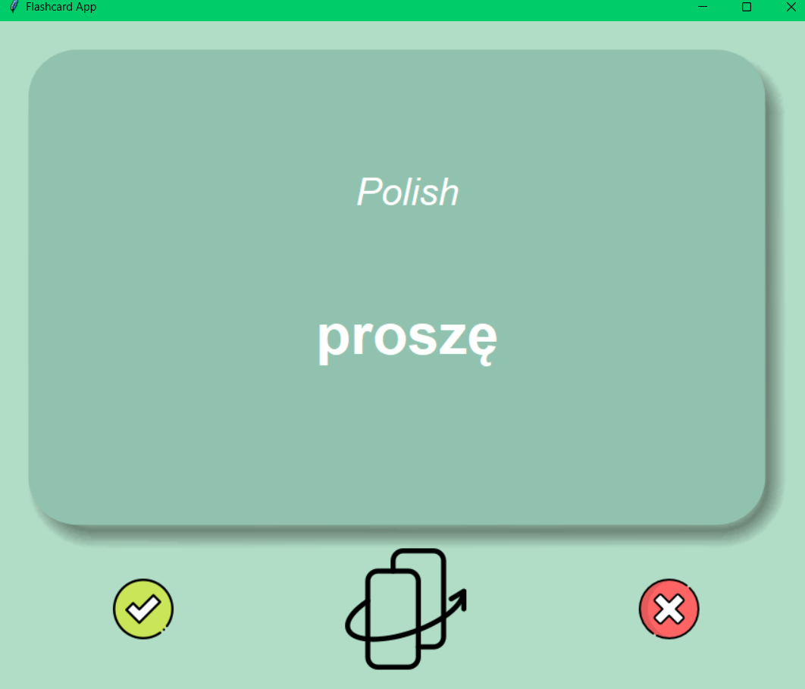

<h1>
🇵🇱 Polish - English Flashcards 🇬🇧
</h1>

---

### Made using TKinter

One of the challenges in a Udemy course I took on Python was to make a 
flashcard app. 

This was perfect timing for me as I had recently started to learn Polish - 
so here it is!

---

### The App

- <code>start</code> - get learning!
- <code>tick</code> - remove word from stack and continue
- <code>cross</code> - remove word from stack and continue
- <code>flip</code> - see translation

### Some Info

- When you cross a word, it will keep it in the stack. When you tick a 
  word it will remove it from stack. This information will persist through 
  the use of JSON files.
- If you want to restart then JSON files will need to be deleted
- The words are taken from a repo (linked below) which is a frequency 
  dictionary for languages. They are the most common words.
- To see the translation - press the flip button in the bottom centre of 
  the screen

---

### Repo for Frequency Words

>>https://github.com/hermitdave/FrequencyWords

---

### Good Luck, Learning Your Language! 😃

I hope you get use out of this like I did. It was actually a very helpful 
little app for starting the very basics of a language. 

It is also more fun learning from something you created yourself.

---

## _Some extra info for those who are curious!_

### Why Am I Learning Polish?

I have **_ALWAYS_** wanted to learn a new language. But a few things 
stopped me.

- Time - life gets busy!
- Confidence
- Immerse in a new culture
- Passion - when I was in secondary school (a long time ago 🥴), I took 
  French as one of my GCSE options for the same reason. I wanted to learn a 
  new language. But I never felt passionate about French. I don't know 
  exactly what it was - but I just didn't enjoy it.

Where I currently work, there a few Polish folk whom are good friends 
of mine. I started to say simple things like **_'Dzień dobry'_** and 
**_'Cześć'_**, which triggered great responses. I started to learn more and 
actually really enjoyed the language - though tough.

I thought - why not, Polish it is.

To any Polish natives or Polish speakers who read this far - see below for 
a Polish introduction of myself 😎

---

### Cześć!

Mam na imię Oliver. Mam dwadzieścia osiem lat (wiem, wiem.. wyglądam młody 
😉) i jestem z Anglii. Uczę się Polskiego, żeby rozmawiać z kolegami i bo 
lubię uczyć się.

Interesuję się muzyką, gitarami, komputerami i kodowaniem.

Lubię jeść pierogi z mięsem i pić kawę... co mogę powiedzieć. Jestem 
głodnym mężczyzną. Widzę jedzenie, jem 😋 

Jaka jest twoja ulubiona kawa? Powiedz mi! 

Od czasu do czasu, lubię spotykać się z przyjaciółmi. Zwykle, bo chodzimy 
na koncert. 

W weekend wstaję wcześnie i rano, studiuję polski. A potem, dla może... 
cztery albo pięć godzin, uczę się kodowania. Wieczorem, mam lekcję polski z 
moją nauczycielką.

Na sto procent - kiedy mówię po polsku, nie jest łatwe. Często zapominam 
jak powiedzieć polski słowa. Ale.. nie od razu Kraków zbudowano, prawda?

Mam nadzieję, że masz świetny dzień! Na razie, cześć. 😃🙋🏻‍️